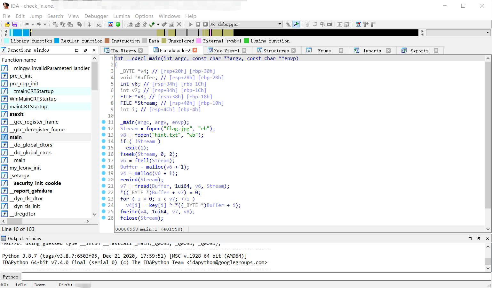
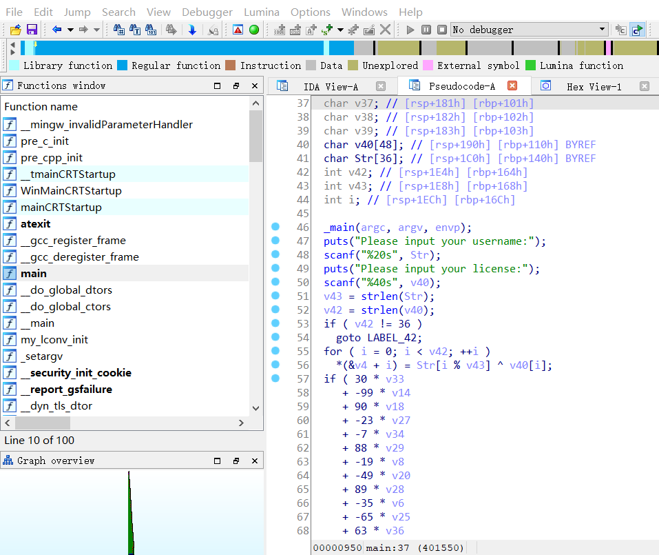
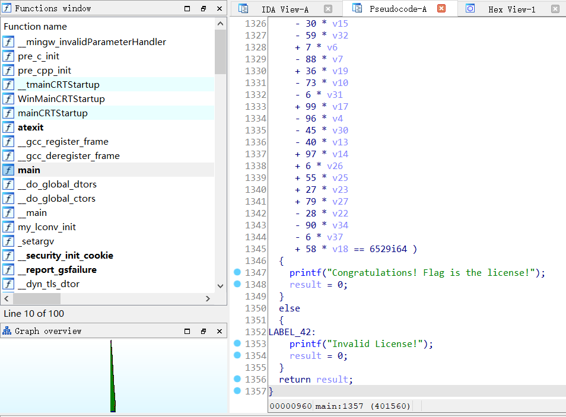

# 【BUAACTF 2021】CTF 校赛总结 

2021-05-17

纪念一下自己第一次尝试 CTF ，比赛体验很好，也收获不少，虽然水平有些 too low（甚至连 IDA 都是在比赛开始之后才下载+现学现卖）

去年疫情在家刷知乎刷到过一些 CTF 相关的内容，当时感觉离自己十分遥远，如今也算是稍稍见识了一下网络安全这个未知但好玩的领域了（当然，以自己的层次大概连"入门"都还远远没有达到吧）。

PWN 方向的题由于这周一直在 Windows 环境下，没时间搞了，略微有些小遗憾。Reverse 从开赛后才想起来下载 IDA 到成功拿下两道(签到题)的二血，小小地骄傲一下（还有两道 Reverse 由于不会破解代码里的(看得让人头大的)加密算法，故半途而废了

题目通过数量：

| crypto | pwn  | web  | reverse | misc |
| ------ | ---- | ---- | ------- | ---- |
| 1      | 0    | 1    | 2       | 1    |

附上两道二血题目的 Writeup：（写得略有点啰嗦 orz）

## re_check_in

给了两个文件，`check_in.exe` 和 `hint.txt` 。

由于题目说了直接运行 exe 会覆盖 `hint.txt` 所以在动手解题之前先把 `hint.txt` 备份一下。

用 IDA 打开 `check_in.exe` ，在左侧直接找到 `main` 函数点开，按 F5 反汇编查看 C 代码：



反汇编出来的 C 代码：

```c
int __cdecl main(int argc, const char **argv, const char **envp)
{
  _BYTE *v4; // [rsp+20h] [rbp-30h]
  void *Buffer; // [rsp+28h] [rbp-28h]
  int v6; // [rsp+34h] [rbp-1Ch]
  int v7; // [rsp+34h] [rbp-1Ch]
  FILE *v8; // [rsp+38h] [rbp-18h]
  FILE *Stream; // [rsp+40h] [rbp-10h]
  int i; // [rsp+4Ch] [rbp-4h]

  _main(argc, argv, envp);
  Stream = fopen("flag.jpg", "rb");
  v8 = fopen("hint.txt", "wb");
  if ( !Stream )
    exit(1);
  fseek(Stream, 0, 2);
  v6 = ftell(Stream);
  Buffer = malloc(v6 + 1);
  v4 = malloc(v6 + 1);
  rewind(Stream);
  v7 = fread(Buffer, 1ui64, v6, Stream);
  *((_BYTE *)Buffer + v7) = 0;
  for ( i = 0; i < v7; ++i )
    v4[i] = key[i] ^ *((_BYTE *)Buffer + i);
  fwrite(v4, 1ui64, v7, v8);
  fclose(Stream);
  fclose(v8);
  return 0;
}
```

可以看到第 12 行与第 13 行有 `fopen` 函数与两个较为明显的文件名。程序需要一个文件 `flag.jpg` 作为输入，并将输出写入 `hint.txt` 。（ `flag.jpg` 从哪来呢？）

本着试试看的态度，将原 `hint.txt` 改名为 `flag.jpg` 并运行 `check_in.exe` ，看到又生成了一个 `hint.txt` 。用文本编辑器打开发现是个二进制文件，并且前几个字节中出现了 `JFIF` 字样，推测出是一张图片（当时自己并不认识 `JFIF` 文件头，只是看到二进制文件并联想起前面出现过的 `flag.jpg` 文件名猜出来是图片）。

将程序生成的 `hint.txt` 扩展名改为 `.jpg` 打开即可得到 flag。

最后还是把 flag 放出来吧，纪念一下第一次接触 CTF \^\_\^（图片已打码）


## zerothree

> 请找出用户 or4nge 的 license

题目只有一个附件 `zerothree.exe` ，下载下来直接用 IDA 打开，在左侧找到 `main` 函数，F5 查看反编译的 C 代码：（果然第二题比第一题操作熟练许多了）





虽然没有第一题那么明显，但代码逻辑还挺清晰的：

- 输入一个字符串 `Str` ，根据题干得出这里应是 `or4nge` 
- "输入"一个字符串 `v40` （license），这里需要根据代码去解出 license 的内容
- 将 `Str` (长度不足就循环拼接) 与 `v40` 逐位做异或，存入以局部变量 `v4` 为起始的连续 36 字节的(栈区)空间中，也就是 `main` 函数中连续定义的 36 个 `char` 变量，这些变量都位于栈中，地址是连续的。
  - 变量 `v##i` 对应 `((char*)&v4)[i - 4]` 
- 判断 `v4` 到 `v39` 这些变量是否满足下面的一系列等式，如果满足则输入的 license 就是正确的 flag 。

附上 `main` 函数的 C 代码（部分相似内容已略去）

```c
int __cdecl main(int argc, const char **argv, const char **envp)
{
  int result; // eax
  char v4; // [rsp+160h] [rbp+E0h]
  char v5; // [rsp+161h] [rbp+E1h]
  /* ... Omitted 33 lines here ... */
  char v39; // [rsp+183h] [rbp+103h]
  char v40[48]; // [rsp+190h] [rbp+110h] BYREF
  char Str[36]; // [rsp+1C0h] [rbp+140h] BYREF
  int v42; // [rsp+1E4h] [rbp+164h]
  int v43; // [rsp+1E8h] [rbp+168h]
  int i; // [rsp+1ECh] [rbp+16Ch]

  _main(argc, argv, envp);
  puts("Please input your username:");
  scanf("%20s", Str);
  puts("Please input your license:");
  scanf("%40s", v40);
  v43 = strlen(Str);
  v42 = strlen(v40);
  if ( v42 != 36 )
    goto LABEL_42;
  for ( i = 0; i < v42; ++i )
    *(&v4 + i) = Str[i % v43] ^ v40[i];
  if ( 30 * v33
     + -99 * v14
     /* ... Omitted 33 lines here ... */
     - 67 * v22 == -12868i64
    && 30 * v9
     /* ... Omitted 1251 lines (34 `&&`s and 34 `==`s) here ... */
     + 58 * v18 == 6529i64 )
  {
    printf("Congratulations! Flag is the license!");
    result = 0;
  }
  else
  {
LABEL_42:
    printf("Invalid License!");
    result = 0;
  }
  return result;
}
```

开始正式解题，解题的关键在于解出满足条件的 `v4` \~ `v39` ，然后将它们与 `Str` 再做一遍异或即可还原出原始的 `flag` 。

观察一下 `if` 的条件，要求若干个等式(方程)同时成立，并且每个方程的形式都是若干个"系数乘以变量"之和等于一个常数（这中间有极少数例外，没有系数或者按位左移的形式，但都可以统一成变量乘系数）。

这分明就是个线性方程组！（ Ctrl+F 搜索一下，`&&` 刚好有 35 个，`==` 刚好有 36 个，也就是刚好 36 个方程，对应 36 个未知数，如果方程之间两两线性无关则方程组有唯一解）

接下来的任务变成了从这一串长长的条件表达式中提取出系数和常数（将方程还原成矩阵形式 $AX=b$ ）。首先通过字符串的正则查找替换将表达式处理成统一的格式，然后编写 Python 代码进行系数、常数的提取。

### 字符串预处理(手动)

采用 VSCode 进行处理（在正则查找与替换下，替换目标文本中采用 `$1`, `$2` 等来表示匹配模式串中小括号内的内容）：

- 将所有条件合并到一行：在 C 语法配置下，右键-Format Document
- 根据 `&&` 分割，一行一个等式：`&&` $\rightarrow$ `\n` 
- 去掉 IDA 反编译出来的整数的 `i64` 后缀：`(\d+)i64` $\rightarrow$ `$1` 
- 将右移转换为乘法：`\((v\d+) << 6\)` $\rightarrow$ `64 * $1` 
- 给每一行的行首第一项前面补上 `+` 号（使得与后面的项格式一致）：利用 Alt+Shift 同时选中多行，手动添加
- 给没有系数的项补上系数 1：`([+\-]) (v\d+)` $\rightarrow$ `$1 1 * $2` 

经过上述处理后，将 `if` 条件处理成了一个格式统一的方程组，共 36 行，每行一个方程，并且每一项满足正则表达式：`([+\-]) (-?\d+) \* v(\d+)` (三个括号分别代表项的正负号，系数和变量的编号)

### 正式求解(Python)

采用 Python 的 `re` 库解析上述的线性方程组，提取系数和常数，并将其填入矩阵和向量中的相应位置（假设下标从 0 开始）：

- 第 $i$ 个方程的常数项对应 $b_i$ 
- 第 $i$ 个方程中变量 $v_j$ 的系数对应系数矩阵中的 $a_{i,j-4}$ 
- 相应位置未出现过的系数为 0 

还原出 $A$ 和 $b$ 后利用 `numpy.linalg` 库求解线性方程组，还原出 `v4` \~ `v39` 对应的字符的 ascii 码，然后与 `Str` 进行一遍异或即可还原出 flag。

```python
expr = '''
+ 30 * v33 + -99 * v14 + 90 * v18 + -23 * v27 + -7 * v34 + 88 * v29 + -19 * v8 + -49 * v20 + 89 * v28 + -35 * v6 + -65 * v25 + 63 * v36 + 53 * v15 + 66 * v19 + -42 * v21 + 29 * v4 + 70 * v23 + -20 * v16 + -37 * v5 - 58 * v37 + 17 * v11 + 26 * v35 - 56 * v30 + 67 * v39 + 11 * v10 - 53 * v7 + 9 * v13 - 50 * v32 - 48 * v12 - 70 * v26 + 48 * v17 + 1 * v31 - 33 * v24 - 68 * v38 - 14 * v9 - 67 * v22 == -12868  
+ 30 * v9 + 47 * v37 + 1 * v18 + -47 * v20 + -41 * v29 + 60 * v26 + 90 * v13 + 62 * v14 + 57 * v27 + -91 * v31 + 10 * v39 + 13 * v6 + 57 * v8 + 90 * v25 + -57 * v19 + 64 * v22 - 63 * v17 - 56 * v12 + 56 * v35 - 40 * v4 - 92 * v21 - 5 * v33 - 13 * v16 + 5 * v32 - 63 * v36 + 5 * v30 + 67 * v38 - 20 * v5 - 79 * v23 - 17 * v10 + 70 * v7 + 41 * v11 + 71 * v28 + 15 * v15 + 42 * v24 == 8520  
+ 69 * v28 + 58 * v33 + 34 * v27 + 49 * v5 + 88 * v39 + 50 * v24 + 7 * v4 + -99 * v31 + -100 * v34 + 74 * v38 + 77 * v37 + -77 * v18 + 29 * v20 + 53 * v13 + -13 * v36 + 93 * v15 + -53 * v14 + 2 * v11 + 77 * v23 + 28 * v17 - 61 * v8 + 12 * v21 - 87 * v29 + 36 * v10 + 59 * v7 + 81 * v25 + 28 * v32 + 73 * v30 + 54 * v26 - 5 * v35 - 41 * v6 + 5 * v22 - 93 * v19 + 10 * v16 - 27 * v12 + 24 * v9 == 12936  
+ -61 * v6 + -100 * v22 + -77 * v20 + 86 * v15 + -77 * v11 + -52 * v14 + 58 * v21 + 51 * v17 + 53 * v25 + 43 * v19 + -96 * v16 + -9 * v28 + -44 * v5 + -61 * v33 + 23 * v12 + 94 * v34 + 8 * v32 + 51 * v8 + -46 * v23 + -61 * v10 - 46 * v24 - 76 * v38 - 17 * v35 - 52 * v39 + 81 * v37 + 75 * v36 + 5 * v30 + 2 * v29 + 31 * v26 - 2 * v4 - 17 * v27 - 92 * v18 + 13 * v9 - 99 * v7 + 63 * v31 + 8 * v13 == -5016  
+ 64 * v5 + 17 * v17 + 91 * v4 + -25 * v8 + -36 * v31 + 37 * v39 + 68 * v32 + 78 * v26 + -44 * v11 + 60 * v23 + -69 * v13 + -81 * v37 + -69 * v30 + 32 * v22 + -29 * v18 + 59 * v7 + 9 * v20 - 35 * v25 + 40 * v15 + 70 * v33 + 3 * v6 + 61 * v10 + 40 * v38 + 23 * v21 + 81 * v16 - 43 * v36 + 9 * v19 + 69 * v34 - 9 * v27 - 75 * v29 - 62 * v24 + 56 * v35 + 96 * v9 + 69 * v12 + 80 * v14 + 99 * v28 == 12113  
+ -86 * v31 + 66 * v33 + 93 * v5 + 78 * v28 + -63 * v25 + 51 * v36 + -39 * v9 + -36 * v39 + -34 * v29 + 79 * v15 + -89 * v6 + 32 * v35 + -86 * v17 + -13 * v37 + 51 * v27 + 50 * v24 + 47 * v20 + -79 * v30 - 20 * v12 + 90 * v10 + 6 * v34 - 41 * v11 - 56 * v18 + 54 * v23 - 96 * v38 - 64 * v8 + 48 * v14 - 76 * v32 + 48 * v22 - 3 * v4 + 20 * v7 + 61 * v21 - 56 * v19 - 97 * v26 + 96 * v13 - 61 * v16 == -15499  
+ -32 * v27 + -44 * v39 + 83 * v13 + -66 * v15 + -13 * v4 + 83 * v17 + 22 * v38 + 98 * v11 + 99 * v36 + 83 * v23 + 91 * v9 + 76 * v37 - 74 * v32 - 25 * v6 - 9 * v35 + 35 * v29 + 31 * v22 - 95 * v25 + 37 * v26 - 74 * v20 + 17 * v16 - 27 * v28 + 11 * v7 - 26 * v34 - 36 * v8 + 64 * v10 - 65 * v30 - 46 * v12 - 33 * v18 - 45 * v5 - 60 * v31 + 77 * v24 + 96 * v19 - 23 * v14 - 5 * v33 - 73 * v21 == 4675  
+ -83 * v9 + -11 * v22 + 78 * v37 + -51 * v18 + 69 * v31 + 76 * v5 + -26 * v15 + -88 * v7 + 82 * v12 + -79 * v14 + 86 * v17 + -36 * v8 + 24 * v25 + -99 * v34 + 60 * v33 + -34 * v36 + 69 * v21 + -93 * v30 + 42 * v28 + 55 * v20 + 32 * v29 - 57 * v35 + 84 * v16 + 9 * v27 - 84 * v6 - 18 * v11 - 1 * v4 + 9 * v39 + 89 * v19 + 72 * v23 - 8 * v32 + 70 * v24 - 36 * v26 + 64 * v10 + 19 * v13 + 71 * v38 == -303  
+ -60 * v5 + -16 * v33 + 79 * v14 + 65 * v36 + 50 * v34 + -70 * v12 + -59 * v23 + -58 * v11 + -51 * v9 + 94 * v13 + -57 * v29 + 88 * v22 + -20 * v15 + 86 * v4 + -68 * v8 + 57 * v18 + 28 * v32 + 29 * v16 + -31 * v21 + 75 * v10 + -54 * v6 - 80 * v19 + 82 * v17 - 18 * v27 - 2 * v7 + 94 * v35 - 6 * v25 + 26 * v20 - 62 * v38 - 82 * v31 + 25 * v24 - 66 * v39 - 62 * v28 + 89 * v30 + 12 * v26 - 86 * v37 == 12337  
+ -88 * v8 + -63 * v4 + 83 * v22 + -49 * v38 + 72 * v12 + -11 * v6 + -30 * v17 + -46 * v10 + 77 * v27 + -7 * v35 + -7 * v28 + 14 * v30 + -75 * v26 + 38 * v7 + -11 * v21 - 91 * v24 + 53 * v39 + 31 * v9 + 47 * v23 + 48 * v37 + 74 * v5 - 24 * v34 + 87 * v13 + 33 * v15 + 86 * v32 + 37 * v25 - 97 * v31 + 31 * v18 + 30 * v14 + 72 * v33 - 59 * v20 + 5 * v11 - 3 * v19 + 13 * v16 - 73 * v36 - 56 * v29 == -5666  
+ 26 * v29 + 84 * v6 + -52 * v7 + 49 * v4 + -81 * v12 + 59 * v27 + -66 * v38 + -85 * v26 + -27 * v5 + -70 * v14 + -95 * v17 + -89 * v16 + -66 * v32 + 77 * v34 + 14 * v19 + -97 * v10 - 74 * v24 - 91 * v8 - 5 * v23 - 94 * v33 - 24 * v39 - 7 * v36 + 63 * v9 - 49 * v18 - 96 * v22 - 100 * v11 + 81 * v20 + 70 * v15 + 3 * v25 + 28 * v28 - 14 * v13 + 59 * v21 + 24 * v35 - 25 * v31 + 20 * v37 - 77 * v30 == -16449  
+ 60 * v6 + 69 * v14 + 55 * v27 + 30 * v9 + 34 * v10 + 53 * v39 + 70 * v23 + 2 * v11 + 98 * v32 + 42 * v15 + -91 * v30 + -63 * v33 + -58 * v8 + -53 * v26 + 1 * v20 + 22 * v25 + -19 * v17 + 83 * v19 + 69 * v22 + 55 * v28 + -69 * v29 + 33 * v24 + 28 * v38 + 5 * v7 + 35 * v12 + 27 * v5 - 31 * v31 + 10 * v16 + 84 * v37 + 24 * v18 - 2 * v21 + 68 * v36 + 21 * v4 - 1 * v13 + 60 * v35 - 60 * v34 == 16413  
+ -17 * v36 + 1 * v34 + 14 * v18 + -97 * v31 + 32 * v8 + 90 * v33 + 50 * v12 + -92 * v17 + -61 * v19 + 64 * v22 + 60 * v15 + 76 * v14 + 70 * v38 + -68 * v16 + -81 * v13 + 38 * v23 + 15 * v35 - 96 * v25 + 89 * v24 + 33 * v6 + 79 * v32 - 80 * v39 - 38 * v9 + 5 * v10 - 8 * v30 - 59 * v27 + 9 * v28 + 34 * v21 - 60 * v5 + 98 * v29 + 48 * v20 - 88 * v26 - 96 * v7 + 97 * v11 - 96 * v4 + 54 * v37 == -5321  
+ -98 * v26 + -57 * v34 + 53 * v12 + -58 * v36 + -82 * v14 + 68 * v37 + 57 * v35 + -92 * v16 + -98 * v32 + -50 * v4 + -45 * v20 + 60 * v29 + 49 * v21 - 7 * v7 - 22 * v27 + 33 * v17 - 15 * v9 + 36 * v33 - 88 * v19 + 12 * v25 + 71 * v18 - 48 * v39 + 79 * v38 - 5 * v23 - 2 * v8 - 29 * v28 - 28 * v30 - 16 * v22 - 64 * v31 + 32 * v15 + 73 * v6 - 38 * v24 + 27 * v13 - 7 * v11 - 30 * v5 - 35 * v10 == -16134  
+ 58 * v20 + 91 * v12 + 91 * v19 + -31 * v25 + -69 * v37 + -86 * v32 + -78 * v21 + -20 * v34 + 19 * v16 + -22 * v15 + 71 * v31 + -85 * v23 + 29 * v24 + 60 * v18 + 4 * v35 - 43 * v22 - 36 * v33 + 95 * v13 + 6 * v38 + 49 * v10 + 13 * v14 - 23 * v17 + 17 * v11 - 79 * v26 + 12 * v7 - 7 * v8 - 12 * v6 - 91 * v27 - 56 * v9 + 59 * v30 + 18 * v36 - 87 * v39 - 30 * v28 + 54 * v29 - 5 * v5 - 94 * v4 == 2487  
+ -33 * v15 + 80 * v10 + 9 * v20 + 63 * v5 + -44 * v27 + -71 * v30 + -78 * v17 + -95 * v9 + -94 * v14 + -11 * v23 + 97 * v4 + 52 * v19 + -89 * v25 + 56 * v31 + -87 * v8 + -73 * v39 + -85 * v24 + -17 * v13 - 93 * v16 - 87 * v28 - 80 * v29 - 92 * v33 - 20 * v21 - 13 * v12 + 80 * v35 - 1 * v37 + 37 * v34 + 64 * v36 - 18 * v22 - 76 * v38 + 65 * v7 + 61 * v11 + 11 * v26 - 39 * v18 - 62 * v6 - 74 * v32 == -38279  
+ 75 * v20 + -95 * v12 + 77 * v35 + 69 * v33 + -85 * v38 + 59 * v10 + 43 * v37 + -65 * v23 + 63 * v19 + -40 * v18 + 20 * v17 + 36 * v27 + 31 * v9 + -45 * v29 + -61 * v28 + 65 * v26 + 54 * v24 - 9 * v13 + 47 * v8 - 40 * v6 - 64 * v16 + 81 * v14 - 35 * v4 - 12 * v31 + 35 * v34 + 31 * v22 - 42 * v39 + 33 * v15 + 76 * v36 - 4 * v30 - 19 * v7 + 65 * v25 - 78 * v11 - 48 * v32 - 77 * v21 == 3750  
+ -25 * v32 + -51 * v5 + -92 * v31 + 47 * v35 + 33 * v36 + -37 * v13 + 95 * v9 + 67 * v27 + -38 * v14 + 35 * v10 + -63 * v34 + -93 * v38 + 28 * v12 + -41 * v11 + 71 * v28 + -73 * v19 + 76 * v17 + 35 * v24 + 55 * v21 - 12 * v4 + 84 * v16 - 72 * v7 - 4 * v20 + 99 * v15 + 10 * v8 - 98 * v39 - 9 * v22 + 22 * v25 - 6 * v30 - 71 * v29 + 96 * v18 + 82 * v6 - 6 * v37 - 13 * v33 + 25 * v26 - 35 * v23 == 8374  
+ 88 * v38 + -65 * v32 + -50 * v29 + 56 * v19 + 78 * v6 + 93 * v12 + 64 * v25 + 98 * v20 + 2 * v34 + -41 * v22 + 87 * v11 + -34 * v21 + -49 * v8 + 54 * v4 + -72 * v17 + 87 * v28 + 79 * v31 - 52 * v33 - 17 * v27 + 45 * v14 - 17 * v37 - 81 * v15 + 37 * v39 - 46 * v13 + 25 * v36 - 45 * v18 - 30 * v16 + 83 * v23 + 24 * v5 - 51 * v10 - 17 * v30 - 76 * v7 - 36 * v35 + 77 * v24 - 62 * v9 + 67 * v26 == 19675  
+ 82 * v36 + -25 * v8 + 61 * v14 + -71 * v34 + -29 * v11 + 30 * v5 + 34 * v39 + -74 * v17 + 8 * v37 + -50 * v29 + -35 * v33 + 75 * v35 + 92 * v10 + -70 * v30 + 55 * v25 + -21 * v23 + 37 * v21 + 29 * v28 - 10 * v19 - 75 * v20 + 24 * v22 + 98 * v4 + 41 * v24 - 54 * v32 - 5 * v27 - 66 * v13 + 3 * v9 + 62 * v26 - 40 * v38 + 90 * v7 - 36 * v18 - 66 * v6 + 15 * v16 - 74 * v31 + 31 * v12 - 68 * v15 == -21872  
+ 37 * v20 + 84 * v26 + 77 * v35 + -75 * v12 + 55 * v39 + -83 * v33 + -79 * v28 + 35 * v30 + -71 * v10 + -66 * v11 + 64 * v29 + -69 * v7 + 98 * v13 + 28 * v21 + -11 * v23 + -13 * v19 - 34 * v17 + 75 * v38 + 19 * v36 - 94 * v37 - 72 * v22 - 32 * v31 + 76 * v5 + 80 * v32 + 66 * v14 + 3 * v16 - 99 * v18 + 17 * v34 - 94 * v4 + 12 * v6 + 61 * v24 - 24 * v27 + 62 * v15 - 65 * v25 - 2 * v8 - 90 * v9 == 13561  
+ 19 * v23 + 21 * v5 + 68 * v37 + 39 * v27 + 43 * v15 + 64 * v19 + -34 * v30 + -20 * v35 + 31 * v21 + -10 * v39 + 47 * v13 + -42 * v36 + 80 * v28 + -37 * v8 + -94 * v20 + -76 * v6 + 24 * v7 - 31 * v11 - 65 * v4 - 23 * v26 - 48 * v24 - 95 * v10 - 30 * v38 - 67 * v16 + 81 * v18 - 21 * v31 + 65 * v22 + 60 * v29 - 17 * v25 - 58 * v17 + 96 * v12 - 32 * v34 - 83 * v32 + 20 * v9 - 3 * v33 + 7 * v14 == -15976  
+ -80 * v25 + 48 * v21 + -88 * v22 + -37 * v34 + 1 * v7 + 67 * v15 + 52 * v10 + 14 * v31 + -82 * v27 + -52 * v11 + -15 * v17 + 56 * v23 + 97 * v36 + -55 * v12 + -41 * v35 + -46 * v16 + -84 * v39 + 55 * v13 + -91 * v19 + -59 * v30 + 93 * v6 + 53 * v24 + -92 * v28 + -82 * v26 - 76 * v4 - 90 * v9 + 3 * v38 + 77 * v29 - 40 * v20 - 93 * v8 + 37 * v37 - 16 * v14 + 1 * v18 + 17 * v33 - 94 * v32 - 12 * v5 == -9828  
+ -52 * v35 + 22 * v22 + -12 * v33 + -89 * v23 + 22 * v29 + 42 * v34 + -26 * v4 + 46 * v13 + 53 * v5 + 34 * v16 + -91 * v19 + 23 * v24 + -91 * v37 + -25 * v27 + 84 * v15 + 68 * v6 + -35 * v20 + -74 * v31 + -85 * v17 + 58 * v7 + 95 * v32 + -79 * v30 + -94 * v14 + -76 * v8 + -55 * v9 - 71 * v25 - 87 * v18 - 65 * v38 - 16 * v28 + 34 * v36 - 16 * v11 + 83 * v26 + 5 * v21 - 71 * v10 + 41 * v39 + 68 * v12 == -17536  
+ -18 * v5 + 35 * v8 + -59 * v14 + -98 * v35 + -95 * v34 + -50 * v17 + 64 * v18 + 95 * v21 + 59 * v26 + 54 * v9 + 89 * v31 + -87 * v7 + -19 * v23 - 97 * v16 + 62 * v30 + 6 * v24 - 68 * v20 + 10 * v4 - 1 * v6 - 1 * v32 + 17 * v22 - 76 * v10 - 24 * v27 - 76 * v15 + 33 * v38 - 53 * v12 + 9 * v36 - 45 * v13 - 60 * v33 - 74 * v39 + 31 * v11 + 50 * v28 + 25 * v25 - 83 * v37 + 25 * v29 + 52 * v19 == -9636  
+ 99 * v23 + 70 * v36 + 98 * v37 + -53 * v24 + -54 * v34 + 30 * v32 + -42 * v39 + -34 * v19 + 77 * v25 + -68 * v9 + -50 * v7 + 44 * v6 + 88 * v5 + -39 * v10 + -79 * v21 + -29 * v17 + 52 * v33 + -55 * v15 + 40 * v14 + -45 * v30 + -54 * v11 + -73 * v18 + 84 * v38 - 27 * v29 - 97 * v22 + 73 * v31 + 32 * v28 - 80 * v4 - 2 * v26 - 44 * v35 - 62 * v12 - 51 * v8 + 12 * v20 - 55 * v13 + 40 * v16 + 76 * v27 == 9324  
+ -39 * v16 + 9 * v11 + -28 * v12 + -17 * v21 + -83 * v37 + 16 * v20 + 74 * v34 + 20 * v15 + 70 * v9 + 69 * v7 + -82 * v30 + -78 * v35 + -31 * v32 + -76 * v23 + 70 * v17 + 86 * v24 + 77 * v18 + 48 * v19 + 95 * v10 - 60 * v8 + 30 * v31 + 3 * v33 - 29 * v36 + 5 * v28 + 55 * v4 + 36 * v27 - 90 * v26 + 37 * v39 + 78 * v38 - 64 * v5 + 16 * v6 - 62 * v14 + 46 * v13 + 63 * v25 - 64 * v22 - 27 * v29 == 1836  
+ -20 * v30 + -60 * v14 + -79 * v36 + -29 * v31 + -97 * v38 + 85 * v20 + -55 * v7 + -7 * v23 + -71 * v6 + 97 * v25 + 89 * v19 + 58 * v17 + 39 * v27 + -82 * v21 + -46 * v13 + -63 * v16 + 64 * v12 + -39 * v34 + -47 * v9 + -89 * v15 + -57 * v28 + 92 * v10 + 7 * v4 - 81 * v5 + 33 * v33 + 89 * v11 - 14 * v24 + 97 * v37 + 10 * v39 - 46 * v18 + 81 * v8 + 50 * v32 + 81 * v26 - 44 * v35 + 18 * v22 + 91 * v29 == -20826  
+ 69 * v25 + 64 * v23 + -22 * v19 + 67 * v33 + -41 * v14 + -47 * v8 + -63 * v17 + 98 * v12 + 82 * v32 + 91 * v37 + 88 * v36 + -48 * v10 + -5 * v5 + 92 * v35 + 88 * v34 + -45 * v28 + -70 * v15 + -93 * v39 + -89 * v29 + 52 * v22 + 49 * v21 + 44 * v30 - 16 * v26 - 8 * v13 - 1 * v20 - 4 * v31 - 79 * v16 - 18 * v6 + 23 * v24 - 20 * v18 + 91 * v9 - 6 * v11 + 84 * v7 - 6 * v38 - 4 * v27 - 80 * v4 == 13298  
+ -29 * v14 + -29 * v4 + -35 * v12 + -94 * v16 + -69 * v26 + 99 * v24 + -46 * v36 + -28 * v39 + -57 * v19 + 72 * v6 + -73 * v21 + 34 * v18 + 84 * v34 + -39 * v29 + -51 * v8 + 27 * v20 + -92 * v35 + 61 * v11 + 89 * v15 + 99 * v25 - 48 * v28 - 92 * v22 - 14 * v17 - 1 * v23 + 2 * v13 + 3 * v33 - 61 * v37 - 6 * v30 - 8 * v31 - 72 * v10 - 2 * v27 - 23 * v38 + 41 * v7 + 42 * v32 == -12156  
+ 28 * v17 + 44 * v25 + -51 * v28 + 88 * v18 + -49 * v26 + -29 * v24 + 22 * v33 + 74 * v16 + 58 * v34 + 90 * v23 + -84 * v22 + -37 * v13 + -98 * v19 + -21 * v30 + 49 * v32 + 44 * v5 + 75 * v38 + 32 * v37 + 43 * v14 + -66 * v36 + 85 * v12 + 62 * v29 + 60 * v8 - 40 * v4 + 78 * v20 + 96 * v39 - 2 * v11 + 43 * v6 - 28 * v10 - 77 * v7 - 30 * v21 - 95 * v9 + 5 * v27 + 85 * v35 + 5 * v31 + 47 * v15 == 25730  
+ -95 * v7 + -68 * v6 + 91 * v39 + -85 * v16 + -66 * v4 + 57 * v19 + -89 * v24 + 4 * v33 + -92 * v30 + 30 * v5 + 68 * v18 + -59 * v31 + -15 * v20 + 85 * v14 + -91 * v9 + -25 * v28 + 83 * v27 + -54 * v11 + -92 * v10 + -85 * v8 + 50 * v35 + 46 * v37 + -88 * v22 - 100 * v29 - 91 * v12 + 73 * v36 + 44 * v23 + 5 * v38 - 32 * v25 - 26 * v34 - 56 * v21 - 16 * v17 - 76 * v15 - 48 * v13 - 88 * v26 + 65 * v32 == -28394  
+ 4 * v21 + 8 * v15 + 49 * v39 + -45 * v11 + 16 * v16 + -58 * v22 + -35 * v28 + 85 * v34 + -55 * v29 + 84 * v20 + 88 * v13 + 5 * v5 + -41 * v23 + 62 * v6 + -19 * v25 + -23 * v27 + -71 * v17 - 49 * v24 + 46 * v19 - 2 * v9 + 77 * v10 - 6 * v30 + 51 * v37 - 96 * v35 + 59 * v18 - 62 * v12 - 32 * v38 + 69 * v36 - 48 * v32 + 54 * v26 - 33 * v8 - 21 * v31 + 31 * v4 - 98 * v14 - 96 * v33 - 71 * v7 == 25355  
+ -81 * v23 + -88 * v15 + -78 * v36 + 99 * v20 + 66 * v28 + 84 * v38 + 88 * v16 + -42 * v8 + -66 * v31 + -66 * v10 + 26 * v12 + -61 * v4 + -69 * v5 + -93 * v13 + 53 * v32 + -100 * v9 + 28 * v19 + -46 * v25 + -50 * v6 + 74 * v24 + 89 * v37 - 30 * v35 - 45 * v26 + 13 * v18 - 29 * v7 + 33 * v14 + 54 * v27 + 18 * v34 - 21 * v39 + 25 * v22 - 39 * v33 + 15 * v17 + 83 * v30 - 28 * v11 + 2 * v29 == 4514  
+ -11 * v14 + 62 * v18 + -7 * v31 + 97 * v9 + 64 * v32 + -5 * v20 + 46 * v4 + 88 * v34 + 59 * v12 + -50 * v10 + 1 * v30 + -7 * v16 + -38 * v13 + 44 * v33 + 40 * v24 + 14 * v37 - 97 * v26 - 43 * v15 + 31 * v17 - 68 * v7 - 36 * v5 - 34 * v19 + 10 * v8 + 84 * v22 + 13 * v11 + 14 * v29 + 10 * v35 + 60 * v28 + 27 * v38 - 31 * v36 - 48 * v23 - 55 * v39 - 96 * v6 - 83 * v27 == -4195  
+ -72 * v20 + 4 * v35 + 58 * v38 + -10 * v39 + 26 * v9 + 90 * v36 + 45 * v21 + 16 * v16 + -32 * v24 + 39 * v33 + -54 * v29 + 57 * v28 + 2 * v11 + -57 * v12 - 99 * v8 - 91 * v5 - 30 * v15 - 59 * v32 + 7 * v6 - 88 * v7 + 36 * v19 - 73 * v10 - 6 * v31 + 99 * v17 - 96 * v4 - 45 * v30 - 40 * v13 + 97 * v14 + 6 * v26 + 55 * v25 + 27 * v23 + 79 * v27 - 28 * v22 - 90 * v34 - 6 * v37 + 58 * v18 == 6529
'''

# 把这个阴间式子转换成矩阵形式
# 从 v4 开始

# 左移: r"\((v\d+) << 6\)" --> "64 * $1"
# 行首手动补上加号
# 乘1: r"([+\-]) (v\d+)" --> "$1 1 * $2"

# 提取项: r"([+\-]) (-?\d+) \* v(\d+)"

import re
import numpy as np

lines = expr.strip().split('\n')

m_vec_len = 36 # 变量个数
m_vec_off = 4 # 变量起始下标

m_b = np.zeros(len(lines), dtype=np.int64)
m_A = np.zeros((len(lines), m_vec_len), dtype=np.int64)

patt_fact = r"([+\-]) (-?\d+) \* v(\d+)"
re_patt_fact = re.compile(patt_fact)

for (ln, line) in enumerate(lines):
    # 对每一行
    sumex, sumval = line.split('==')
    sumex = sumex.strip()
    sumval = sumval.strip()
    sumval = int(sumval)
    
    m_b[ln] = sumval # 提取常数
    facts = re_patt_fact.findall(line) # 拆出每一项
    
    for fact in facts:
        sgn, coe, vid = fact
        coe, vid = int(coe), int(vid)
        if sgn == '-':
            coe = -coe
        m_A[ln, vid - m_vec_off] = coe # 填入系数矩阵
    
print(m_A)
print(m_b)

vec_v = np.linalg.solve(m_A, m_b) # 线性方程组求解
vec_v = np.round(vec_v) # 转成整数
vec_v = vec_v.astype(np.int64)
vec_v = list(vec_v)
print(vec_v)


'''
[  9.  30.  85.   9.  28.  31.  10.  32.   4.  93.  56.  12.  75.  45.
  64.   6.  84.  58.  13.  23.   1.  26.  56.  40.  46.  38.  92.  49.
  20.  10.  94.   4. 113.  60.  70.  24.]
[9, 30, 85, 9, 28, 31, 10, 32, 4, 93, 56, 12, 75, 45, 64, 6, 84, 58, 13, 23, 1, 26, 56, 40, 46, 38, 92, 49, 20, 10, 94, 4, 113, 60, 70, 24]
'''

# 最后的解密！
c_Str = "or4nge"
c_v42 = 36
c_v43 = len(c_Str)
assert c_v42 == len(vec_v)

l_ans = [0] * 36
for i in range(c_v42):
    l_ans[i] = ord(c_Str[i % c_v43]) ^ vec_v[i]

print("".join([chr(x) for x in l_ans])) # 最终 flag
```

> zero3 is the best math solver！
