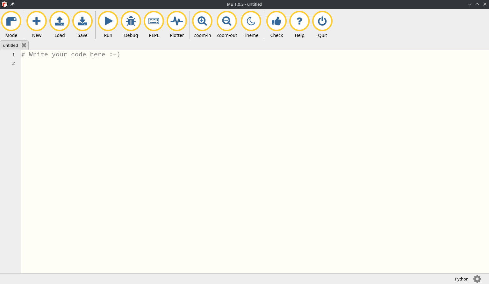

# MicroPython 学习笔记 (1) - 开发环境配置

2022-01-18

# MicroPython 学习笔记 (1) - 开发环境配置

前期入手了一块 MicroPython-ESP32 开发板，第一件事是配置开发环境。笔者日常使用的是 Manjaro Linux 操作系统，在此文记录下配置开发环境的过程。

## Mu Editor

开发板厂家提供的资料里推荐使用 Mu Editor 作为开发工具，所以首先尝试安装 Mu Editor。

官网地址：https://codewith.mu/

官网上提供了 Windows 系统的安装包，直接下载安装即可。对于 Linux 系统没有提供安装包，需要根据官网的[安装教程](https://codewith.mu/en/howto/1.1/install_with_python)使用 Python 的 `pip` 工具安装。

根据官网提供的建议，为了防止和主机上的 Python 环境发生依赖冲突，可使用[虚拟环境](https://pypi.org/project/virtualenv/)安装 Mu Editor。创建和管理 Python 虚拟环境使用 `virtualenv` 包，如果还没有安装该包可使用 `pip install virtualenv` 或 `pip3 install virtualenv` 安装。Python 虚拟环境提供了一个独立的存放 Python 解释器和第三方包的目录，其与主机的 Python 环境相互隔离，可使用虚拟环境指定 Python 解释器的版本和第三方包的版本，从而很好地解决版本冲突。

### 安装

在创建虚拟环境前，首先指定创建虚拟环境的位置，在本示例中，虚拟环境存放在用户家目录下的 `venv` 目录下。

```bash
mkdir -p ~/venv # 在家目录下创建 venv 目录用于存放虚拟环境
cd ~/venv       # 将终端切换到 venv 目录下
```

创建一个名为 `mueditor` 的虚拟环境，并且指定 Python 解释器版本为 3.7。

```bash
virtualenv mueditor --python=python3.7
```

> 注意事项：
> 
> - 如系统默认的 Python 版本高于 3.7，请使用 3.7 版本创建虚拟环境。过高的版本会造成后续安装错误。
> - 创建虚拟环境前需保证 3.7 版本的 Python 解释器 `python3.7` 已经位于 PATH 中，如果尚未安装需先安装 Python 3.7。

创建完成后，运行以下命令激活虚拟环境：

```bash
source ~/venv/mueditor/bin/activate
```

执行完成后，终端提示符将增加一个 `(mueditor)` 标识，表示当前终端正在处于虚拟环境下（虚拟环境只会作用于当前终端）。

> 如需退出虚拟环境，只需在当前终端下执行 `deactivate`，而后 `(mueditor)` 虚拟环境标记消失。

在虚拟环境下使用 `pip` 命令安装 `mu-editor` 包。由于官方 pip 源访问速度较慢，安装时可使用 `-i` 参数临时指定国内源，这里采用[清华源](https://pypi.tuna.tsinghua.edu.cn/simple)。同时可添加 `--default-timeout` 参数避免由于下载超时导致的安装失败。

```bash
pip install mu-editor -i https://pypi.tuna.tsinghua.edu.cn/simple --default-timeout=100000
```

之后只需<del>漫长的</del>等待直到安装完成即可。

先前提到安装 mu-editor 的虚拟环境需使用 3.7 版本的 Python，如果使用了更高版本，在安装依赖时可能遇到错误，无法安装要求版本 `<2.0, >=1.9.2` 的 `pygame` 包。经笔者实测，使用 3.7 版本的 Python 无此问题。

安装完成后，在激活虚拟环境的终端中执行 `mu-editor` 即可启动。

运行效果：




### 使用

在使用 Mu Editor 进行开发时，笔者遇到了一个意想不到的情况：Mu Editor 无法检测到 MicroPython 开发板（在 Windows 系统中，如果 Mu Editor 检测到了 MicroPython 硬件连接，在选择 Mode 的窗口中会有 MicroPython 选项，但 Linux 下没有），所以笔者决定放弃 Mu Editor，换用命令行工具进行开发。

## 命令行工具

开发 MicroPython 所需的命令行工具主要包括：

- [`picocom`](https://github.com/npat-efault/picocom): 串口调试软件，用于访问 MicroPython 开发板的 REPL 交互终端。
- [`adafruit-ampy`](https://pypi.org/project/adafruit-ampy/): 用于访问 MicroPython 开发板上的文件系统。
- [`rshell`](https://pypi.org/project/rshell/): Remote Shell for MicroPython，用于访问 MicroPython 开发板的 REPL 交互终端。

### 安装

其中 `picocom` 为 Linux 常用软件，使用系统自带的包管理器安装：

```bash
sudo apt install picocom    # Ubuntu / Debian
sudo pacman -S picocom      # Arch / Manjaro
```

`adafruit-ampy` 和 `rshell` 为 Python 第三方包，使用 `pip` 安装（建议安装在虚拟环境中）：

```bash
pip install adafruit-ampy rshell -i https://pypi.tuna.tsinghua.edu.cn/simple --default-timeout=100000
```

### picocom 串口调试

使用 `picocom` 连接 MicroPython 开发板的调试串口，通常 MicroPython 调试串口的波特率为 115200 （请参考实际开发板的文档）。在本示例中，该串口位于 `/dev/ttyUSB0`。

查看 picocom 帮助：`picocom -h`

运行以下命令启动 `picocom` 进入串口调试界面：

```bash
picocom /dev/ttyUSB0 -b 115200
```

> 在 picocom 运行中，键入 Ctrl+A Ctrl+H 查看命令帮助，键入 Ctrl+A Ctrl+Q 退出。

按下开发板上的 reset 按键，如果板内固件及程序正常启动，可能会有类似以下的输出：

```
ets Jun  8 2016 00:22:57

rst:0x1 (POWERON_RESET),boot:0x13 (SPI_FAST_FLASH_BOOT)
configsip: 0, SPIWP:0xee
clk_drv:0x00,q_drv:0x00,d_drv:0x00,cs0_drv:0x00,hd_drv:0x00,wp_drv:0x00
mode:DIO, clock div:2
load:0x3fff0018,len:4
load:0x3fff001c,len:4928
ho 0 tail 12 room 4
load:0x40078000,len:9332
load:0x40080400,len:6216
entry 0x400806e8
I (434) cpu_start: Pro cpu up.
I (434) cpu_start: Application information:
I (434) cpu_start: Compile time:     07:44:16
I (436) cpu_start: Compile date:     May 29 2019
I (442) cpu_start: ESP-IDF:          v3.3-beta1-268-g5c88c5996
I (448) cpu_start: Starting app cpu, entry point is 0x4008294c
I (0) cpu_start: App cpu up.
I (459) heap_init: Initializing. RAM available for dynamic allocation:
I (465) heap_init: At 3FFAE6E0 len 00001920 (6 KiB): DRAM
I (471) heap_init: At 3FFB9B88 len 00026478 (153 KiB): DRAM
I (478) heap_init: At 3FFE0440 len 00003AE0 (14 KiB): D/IRAM
I (484) heap_init: At 3FFE4350 len 0001BCB0 (111 KiB): D/IRAM
I (490) heap_init: At 40093398 len 0000CC68 (51 KiB): IRAM
I (497) cpu_start: Pro cpu start user code
I (67) cpu_start: Starting scheduler on PRO CPU.
I (0) cpu_start: Starting scheduler on APP CPU.
```

此时串口并没有显示 REPL 交互终端，这是因为装载的用户程序 `main.py` 正在运行，在终端键入 Ctrl+C 停止程序运行，即可回到 MicroPython REPL 交互终端：

```
MicroPython v1.11 on 2019-05-29; ESP32 module with ESP32
Type "help()" for more information.
>>> 
```

### ampy 访问文件系统

MicroPython 开发板内自带一个小文件系统，但是在一些型号的开发板上，其内部的文件系统不能以常规的外接存储设备（如 U 盘或移动硬盘）的方式访问，即不能使用操作系统自带的文件管理器进行管理，而是只能通过 MicroPython 自己的接口（通过调试串口）进行管理，需要用到的工具为 `adafruit-ampy`，其可执行命令为 `ampy`。

终端执行 `ampy --help` 查看帮助。使用 `-p` 选项指定 MicroPython 设备位置，`-b` 选项指定串口波特率，而后使用相应的文件操作命令来访问开发板的文件系统。

一些示例：

```bash
$ ampy -p /dev/ttyUSB0 -b 115200 ls          # 列出开发板上已经存在的文件
/boot.py
/main.py
$ ampy -p /dev/ttyUSB0 -b 115200 get main.py # 获取开发板上的 main.py，内容显示在标准输出
from machine import Pin
import time

LED = Pin(2, Pin.OUT)

while True:
    LED.value(1)
    time.sleep_ms(1000)
    LED.value(0)
    time.sleep_ms(1000)
$ ampy -p /dev/ttyUSB0 -b 115200 put main.py # 上传当前目录下的 main.py 至开发板
$ ampy -p /dev/ttyUSB0 -b 115200 rm boot.py  # 删除开发板上的 boot.py
```

**注意**: ampy 无法在用户程序 (如 `main.py`) 正在运行时访问 MicroPython 文件系统，否则执行 ampy 将无反应。如遇执行无反应，应先使用 `picocom` 进入串口，使用 Ctrl+C 停止用户程序的运行，得到 REPL 终端，令硬件处于调试状态，然后 Ctrl+A Ctrl+Q 退出 picocom 后再执行 ampy 即可正确访问 MicroPython 文件系统。

### rshell

利用 rshell 访问 MicroPython 开发板上的 repl 交互终端，并管理开发板上的文件。

示例：

```bash
rshell -p /dev/ttyUSB0
```

运行 `rshell -h` 查看帮助。

## VSCode 插件

使用 Visual Studio Code 也可进行 MicroPython 开发，例如使用 [MicroPython IDE](https://marketplace.visualstudio.com/items?itemName=dphans.micropython-ide-vscode) 插件（需安装好上一节中所提到的命令行工具）进行程序上传(烧写)等工作。

注：使用 VSCode 编写代码会遇到 `machine` 等 MicroPython 特有的库在导入时有高亮警告提示，无需理会即可（因为这些代码并不需要在计算机上的 Python 环境运行）。

## Thonny IDE

Thonny 也是一款 MicroPython 开发工具，[官方文档](https://github.com/thonny/thonny/wiki)。该 IDE 可以在 Linux 下检测到 MicroPython 开发板并进行 REPL 调试，同时支持 MicroPython 相关库的自动补全（Mu Editor 由于在 Linux 上没有检测到开发板从而没有 MicroPython 特有库的自动补全，VSCode 也没有）