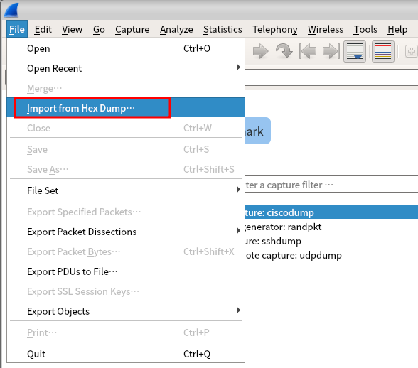
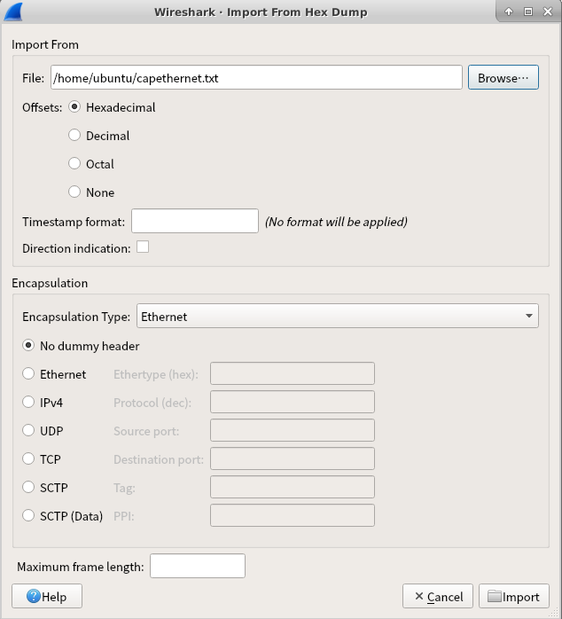
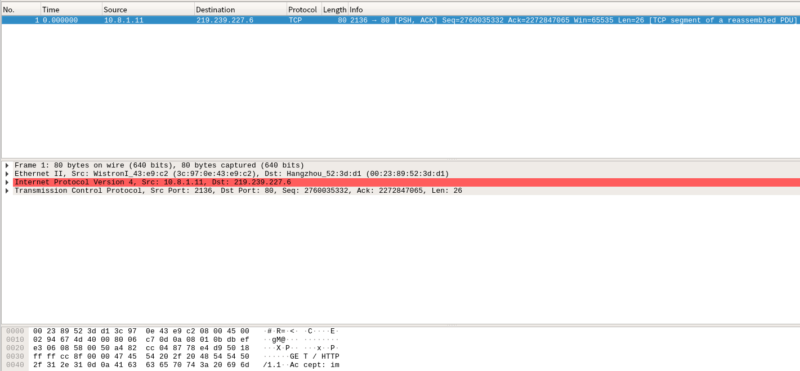
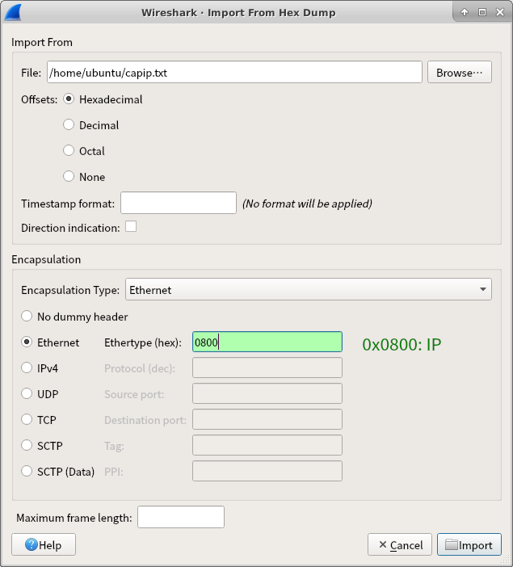
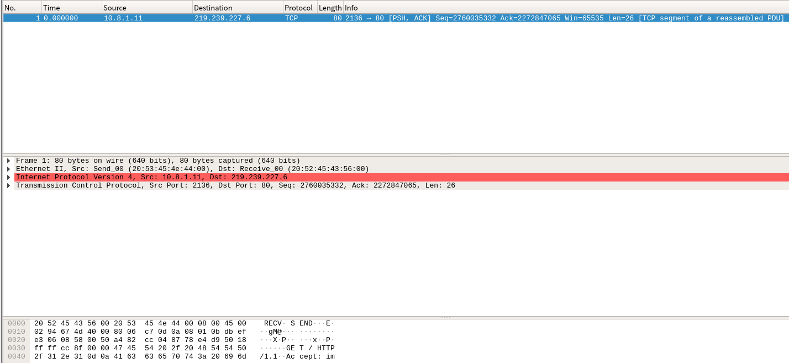
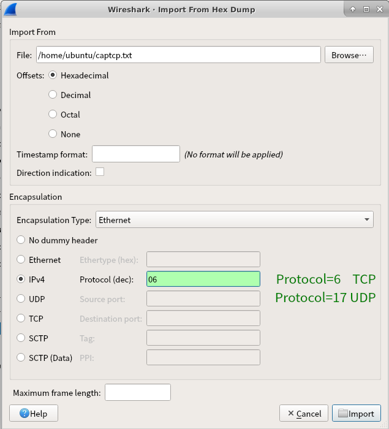
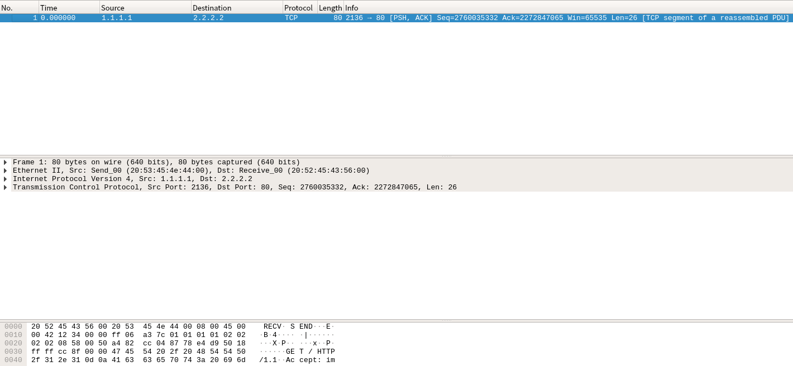

# Wireshark 导入以十六进制给出的报文

2022-06-08

首先将题目给出的帧数据内容输入到文本文件中：每个字节以 2 位十六进制表示，中间以空格隔开，所有字节按顺序位于**一行**中。行首需要添加 `00000000` ，与首个字节之间同样空格隔开。以下为示例：（可直接复制）

```
00000000 00 23 89 52 3D D1 3C 97 0E 43 E9 C2 08 00 45 00 02 94 67 4D 40 00 80 06 C7 0D 0A 08 01 0B DB EF E3 06 08 58 00 50 A4 82 CC 04 87 78 E4 D9 50 18 FF FF CC 8F 00 00 47 45 54 20 2F 20 48 54 54 50 2F 31 2E 31 0D 0A 41 63 63 65 70 74 3A 20 69 6D
```

使用 Wireshark 的 "文件 - 从十六进制导入" 功能，导入上述的报文文本文件以分析报文，而无需人工查阅报文格式手工分析。




以 2020 年春季学期（疫情，线上考试）的报文分析题目为例，文本已在上方给出，可直接复制。

## 以太网帧 - 数据链路层

题目给出的是以太网帧（数据链路层），以如下方式导入：




其中 "封装类型 (Encapsulation Type)" 选择 "Ethernet"。由于本报文就是以太网帧，所以下面选择 "无虚头部 (No dummy header)"。

导入结果：




必要的信息全部包含并已解析出，可直接用于答题。

## IP 数据报 - 网络层

如果给出的是 IP 数据报，即上例中去掉以太网帧头部 14 字节，从 IP 数据报的头部给出报文内容，则导入选项如下：



封装类型仍然选择 Ethernet，由于此时导入的报文只有网络层，以太网帧头部的信息需要以 "虚头部 (dummy header)" 方式给出，其中必需的字段是上层协议类型字段，这里填入 `0800` 表示指明导入的网络层报文属于 IP 协议；目的和源 MAC 地址会在导入时由 Wireshark 自动填充一组值（由于 MAC 地址本来没有给出，所以值是多少无需关心）。导入结果如下：



（只需关心网络层和传输层，数据链路层部分的 MAC 地址仅作填充，没有意义）

## TCP 报文段 - 传输层

如果仅给出了传输层报文（样例报文去掉以太网首部 14 字节以及 IP 首部 20 字节），则导入时按如下配置：



其中 "伪首部 (dummy header)" 选择 IPv4（相当于 IP 层及以前的报文首部都由 Wireshark 补充），其中必需的 IP 层字段是 Protocol，即传输层协议类型。如果已知的传输层报文是 TCP 则此处填 `6` ，如果是 UDP 则此处填 `17` 。导入结果：



其中数据链路层和网络层为 Wireshark 补充（使得以太网帧格式完整，但 MAC 地址与 IP 地址没有意义），传输层部分被解析出。
